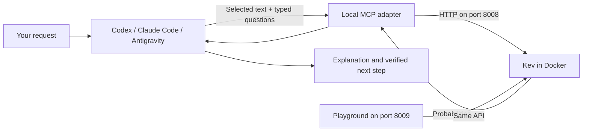

# User Guide

## What You Have Installed

Kev Agent Kit gives your coding agent a local tool for questions with defined
answers: which category, how likely yes, or which ordered level. The coding agent
selects evidence and interprets the response. Kev computes probabilities over the
options supplied to it. It does not write explanations, inspect your repository,
execute commands, or learn automatically from your conversations.

The kit currently provides tools you invoke from a conversation. It does not
automatically monitor email, process tickets, review every commit, or operate a
background business workflow. Those integrations would need to be built separately.



Kev inference happens on your computer. Text supplied to your coding agent and
tool responses can still reach that agent's configured model provider. The
playground calls the local API directly. Docker runs the model service; the
playground and MCP adapter currently run as host processes.

## First Run: Use The Playground

From the repository root, start the model:

```sh
docker compose up -d --build
docker compose ps
```

Wait for the service to be healthy. The first launch downloads model files.
Then, in another terminal:

```sh
npm --prefix playground ci
npm --prefix playground run dev
```

Open http://127.0.0.1:8009. Choose **Support triage**, then click **Run**.
You should see an answer distribution for each question. These are model
predictions, not verified facts. The **JSON** tab shows the API response.

Change the **State** field to your own short message. The **Questions** field is
JSON: keep the type, instructions, and criteria structure when editing it.
**Packed vs separate** compares joint and individual requests; **Permute** checks
whether reordering choice options changes the prediction. Random permutations can
repeat an order, so inspect the returned orders before interpreting stability.

## First Run: Ask Your Agent

Complete the client-specific steps in [setup](codex-local.md). Then try:

> Use Kev to classify this message by department and check whether it reports a
> duplicate charge: “I was charged twice for my shoes.” Show the probabilities,
> explain whether they match the message, and draft a reply for my review.

In Codex, explicitly mention `$kev-decision`; in Claude Code use `/kev-decision`.
In Antigravity, ask it to use the `kev-decision` skill.

A useful response distinguishes the model's prediction from the agent's own
judgment. If Kev reports a surprising category, the agent should show that
disagreement and verify the source text. Calling Kev is optional: for a simple
one-off message, the main agent may already have all the information it needs.

## Three Kinds Of Question

| Type | Supply | Interpret the result |
| --- | --- | --- |
| `noul` | A yes/no question | `noul: 0.96` means the model assigned 0.96 probability to yes |
| `choice` | Named options with descriptions | `probabilities` is the distribution; `choice` is the highest-scoring option |
| `score` | An ordered list such as calm, frustrated, furious | `score: 1.41` is an expected zero-based level between 0 and 2 |

Every question sees the shared state, but cannot see sibling questions. Put all
necessary evidence in state. Do not ask a question to use another question's answer
within the same request; make a second request if that dependency matters.

Confidence is not measured accuracy. For choice questions it rescales the largest
probability relative to a uniform distribution. Score confidence is an approximation.
Probabilities are rounded, so their displayed sum can differ slightly from one.
There is no validated universal threshold for this kit's coding workflows.

## Try The HTTP API

The repository includes a complete request that uses all three question types:

```sh
curl --fail-with-body http://127.0.0.1:8008/v1/systemone \
  -H 'Content-Type: application/json' \
  --data-binary @examples/support-triage.json
```

This works independently of an agent client. API success means the request was
processed; it does not establish that the model's answers are correct.

## When It Helps

Try Kev when you have repeated, clearly defined classification questions and can
compare its predictions with known answers. Examples include message categories,
review sentiment, and experimental issue routing. A single state can answer several
independent questions in one model pass.

Adding a Kev call does not automatically save time or tokens: the main agent still
needs to prepare inputs and read outputs. Measure the whole workflow against a
baseline using only your main agent or simple rules. For exact checks such as a
missing environment variable or a failing assertion, use deterministic tools.

See [practical use cases](use-cases.md) for prompts, expected workflows, and the
model failure observed during this project's local verification.
